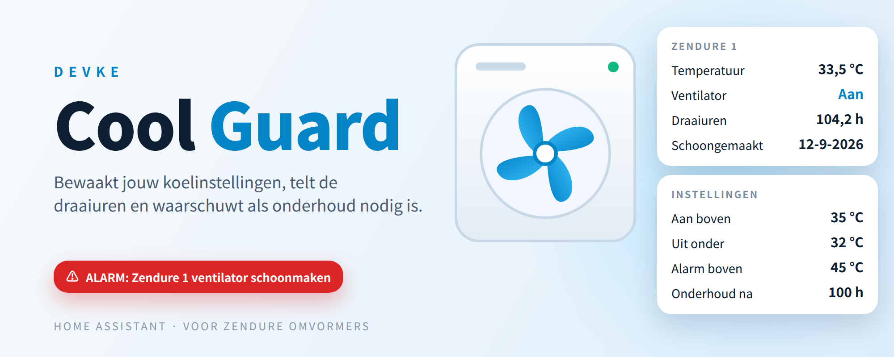
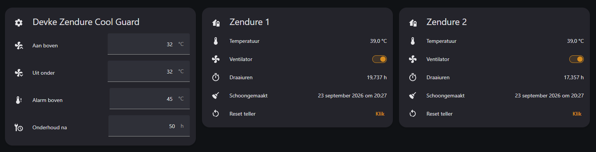
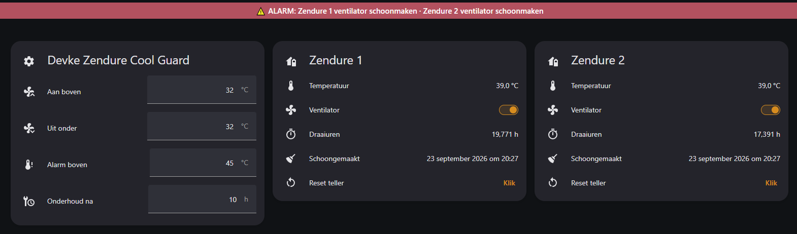
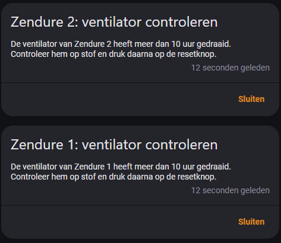

# Devke Zendure Cool Guard

Slimme ventilatorkoeling voor je Zendure omvormer(s) in Home Assistant.

Zendure-omvormers worden in de zomer flink warm. Een ventilator op een slimme stekker helpt, maar Devke Zendure Cool Guard doet meer dan alleen "aan boven X graden": het telt de draaiuren, waarschuwt wanneer de ventilator schoongemaakt moet worden en slaat alarm als de omvormer ondanks de koeling te warm wordt.



*Bij een alarm: rode knipperende strook bovenin elk dashboard*



---

## Features

- Ventilator per Zendure los aangestuurd op temperatuur
- Aan- en uit-temperatuur instelbaar vanaf het dashboard
- Draaiurenteller per ventilator
- Onderhoudsmelding na een instelbaar aantal draaiuren
- Resetknop + datum "laatst schoongemaakt"
- Oververhittingsalarm als de omvormer 10 minuten boven een instelbare temperatuur blijft
- Failsafe: valt de temperatuursensor weg, dan gaat de ventilator aan
- Zelfherstellend: controleert elke minuut en na een herstart of alles goed staat
- Optioneel: rode knipperende alarmstrook bovenin **elk** dashboard met de alarmtekst

## Wat heb je nodig?

- Home Assistant 2024.10 of nieuwer
- **De Zendure-integratie van Gielz: [Zendure-HA-zenSDK](https://github.com/Gielz1986/Zendure-HA-zenSDK)** – Cool Guard gebruikt daaruit de omvormertemperatuur (bijv. `sensor.zendure_2400_ac_omvormer_temperatuur`)
- Per Zendure een ventilator op een schakelbare stekker (`switch`)
- File editor add-on (of Studio Code Server)
- [card-mod](https://github.com/thomasloven/lovelace-card-mod) via HACS – alleen voor de alarmstrook

## Bestanden

| Bestand | Waarvoor |
|---|---|
| `packages/devke_coolguard.yaml` | Helpers en sensoren |
| `automatisering.yaml` | De automatisering (plakken in de GUI) |
| `dashboard/kaart_*.yaml` | Drie dashboardkaarten: instellingen, Zendure 1, Zendure 2 |
| `thema/alarm_blok.yaml` | Alarmstrook voor je eigen thema (Graphite of ander thema) |
| `thema/devke_cool_guard.yaml` | Compleet thema voor wie het standaardthema gebruikt |
| `images/` | Banner (visitekaartje) |
| `screenshots/` | Afbeeldingen voor deze README |

---

## Installatie

### Stap 1 – Packages aanzetten
Zet in `configuration.yaml` (als het er nog niet staat):
```yaml
homeassistant:
  packages: !include_dir_named packages
```
Staat `homeassistant:` er al? Zet dan alleen de regel `packages:` eronder.

### Stap 2 – Package
Maak de map `packages` aan (naast `configuration.yaml`) en zet daar [`packages/devke_coolguard.yaml`](packages/devke_coolguard.yaml) in.

Daarna: **Ontwikkelhulpmiddelen → YAML → Configuratie controleren → HA herstarten**.

### Stap 3 – Automatisering
**Instellingen → Automatiseringen → + Automatisering maken → Nieuwe automatisering → ⋮ → Bewerken in YAML**, alles vervangen door de inhoud van [`automatisering.yaml`](automatisering.yaml) en opslaan.

Meldingen verschijnen bij het belletje in de zijbalk:



### Stap 4 – Waarden instellen (meteen doen!)
Nieuwe helpers starten op hun minimumwaarde. Zet ze direct goed:

| Instelling | Advies |
|---|---|
| Aan boven | 35 °C |
| Uit onder | 35 °C of lager – **nooit hoger dan "aan boven"** |
| Alarm boven | 45 °C |
| Onderhoud na | 100 uur |

### Stap 5 – Dashboard
Maak een dashboard **Alarmen** aan (**Instellingen → Dashboards → + Dashboard toevoegen → Nieuw dashboard vanaf nul**). Voeg via **+ Kaart toevoegen → Handmatig** de drie kaarten uit de map [`dashboard`](dashboard) toe.


### Stap 6 (optioneel) – Alarmstrook bovenin elk dashboard
Bij een alarm verschijnt op elk dashboard een rode knipperende strook met bijv. *"ALARM: Zendure 1 te warm (47 °C)"*, en knippert het menu-item van je Alarmen-dashboard.


Home Assistant gebruikt maar één thema tegelijk, dus het alarm moet in het thema dat jij gebruikt:

**A – Graphite of een ander thema**
1. Open het themabestand in de map `themes` (bijv. `themes/graphite/graphite.yaml`).
2. Plak [`thema/alarm_blok.yaml`](thema/alarm_blok.yaml) direct onder de regel met de themanaam (bijv. `Graphite:`).
3. Vervang `JOUW_THEMA_NAAM` door exact die naam.
4. Staat verderop in het thema al `card-mod-theme:`? Haal die regel weg (anders staat hij dubbel).
5. Heeft je thema `modes:` (licht/donker)? Plak het blok op het bovenste niveau, niet onder `modes:`.

**B – Standaardthema van Home Assistant**
1. Zet in `configuration.yaml`:
   ```yaml
   frontend:
     themes: !include_dir_merge_named themes
   ```
2. Zet [`thema/devke_cool_guard.yaml`](thema/devke_cool_guard.yaml) in de map `themes`.
3. Configuratie controleren → HA herstarten.
4. **Profiel → Thema → Devke Cool Guard**.

**Daarna (A en B)**
- **Ontwikkelhulpmiddelen → Acties → Frontend: Thema's herladen** en browser verversen (Ctrl+F5).
- Controleer dat de URL van je alarmdashboard `/dashboard-alarmen` is. Anders aanpassen in het blok.
- Let op: bij een thema-update via HACS wordt het themabestand overschreven. Plak het blok dan opnieuw.

---

## Aanpassen voor jouw situatie

### Andere entiteiten
De temperatuursensoren komen uit de [Zendure-integratie van Gielz](https://github.com/Gielz1986/Zendure-HA-zenSDK). Hoe ze bij jou heten, zie je bij **Instellingen → Apparaten & diensten → Zendure** (of zoek op `omvormer_temperatuur` bij Ontwikkelhulpmiddelen → Statussen).

Vervang in alle bestanden (zoeken & vervangen):

| Van | Naar |
|---|---|
| `sensor.zendure_2400_ac_omvormer_temperatuur` | temperatuursensor Zendure 1 |
| `switch.zendure_ventilator_3` | ventilatorstekker Zendure 1 |
| `sensor.zendure_2_omvormer_temperatuur` | temperatuursensor Zendure 2 |
| `switch.hw_batterij_socket_1_8` | ventilatorstekker Zendure 2 |

### Maar één Zendure?
- **Package:** verwijder `zendure_2_ventilator_uren`, `zendure_2_ventilator_reset`, `zendure_2_ventilator_schoongemaakt`, de sensoren *Zendure 2 onderhoud nodig* en *Zendure 2 te warm*, en de twee regels met `zendure_2` in *CoolGuard alarm*.
- **Automatisering:** verwijder `sensor.zendure_2_omvormer_temperatuur` uit de eerste trigger, de triggers `melding_2`, `alarm_2` en `reset_2`, het tweede blok onder `sets:` (3 regels), en `melding_2`, `alarm_2`, `reset_2` uit de lijstjes bij de condities.
- **Thema-blok:** verwijder de `if`-blokken met Zendure 2.
- **Dashboard:** laat `kaart_zendure_2.yaml` weg.

### Drie (of meer) Zendures?
- **Package:** kopieer alle `zendure_2`-onderdelen naar `zendure_3` en voeg de twee `zendure_3`-sensoren toe aan *CoolGuard alarm*.
- **Automatisering:** voeg de temperatuursensor toe aan de eerste trigger, kopieer de triggers `melding_2`, `alarm_2`, `reset_2` naar `_3` (met de `zendure_3`-entiteiten), voeg een derde blok toe onder `sets:` en zet `melding_3`, `alarm_3`, `reset_3` in de lijstjes bij de condities.
- **Thema-blok en dashboard:** kopieer de Zendure 2-regels/kaart naar Zendure 3.

> Let op: de sensor heet bewust **CoolGuard alarm** (zonder spatie). Home Assistant maakt daar de entity-ID `binary_sensor.coolguard_alarm` van, waar de rest naar verwijst. Niet hernoemen.

---

## Tips

- Minder schakelen? Zet "uit onder" een paar graden lager dan "aan boven".
- Ventilator handmatig testen? Zet de automatisering even uit, anders zet hij hem binnen een minuut terug.
- Snel testen: zet "Alarm boven" tijdelijk lager dan de huidige temperatuur, of "Onderhoud na" op 1 uur.
- Melding op je telefoon? Voeg in de automatisering een `notify.mobile_app_...`-actie toe naast `persistent_notification.create`.

## Problemen?

| Probleem | Oplossing |
|---|---|
| "Entiteit niet gevonden" | Na stap 2: configuratie controleren en HA herstarten |
| Fout bij configuratie controleren | Meestal inspringing, of een kop die dubbel in `configuration.yaml` staat |
| Niets knippert | card-mod geïnstalleerd? Ctrl+F5? Juiste thema actief in je profiel? |
| Ventilator gaat steeds aan en uit | "Uit onder" staat hoger dan "aan boven" |
| Ventilatoren gaan direct aan na installatie | Stap 4 nog niet gedaan |

---

Vragen of verbeteringen? Maak een [issue](../../issues) aan of reageer in het topic op Tweakers.

Gemaakt door **Devke**.
